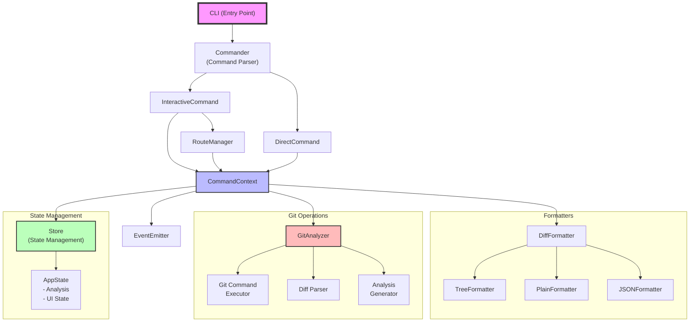

# diff-rettier (이름은 변경될 수 있음)

A CLI tool for analyzing and visualizing differences between branches, tags, and commits. 
Especially useful for managing code synchronization in projects with delayed deployments.

## Key Features

- 🔍 **Diff Analysis**: Analyze differences between branches, tags, and commits
- 📊 **Multiple Visualizations**: View results in various formats including Tree, Plain, and JSON
- 🌳 **Folder Structure Visualization**: Display changes hierarchically according to folder structure
- 💡 **Interactive Interface**: Step-by-step analysis through an intuitive CLI
- 🎯 **Pattern-based Filtering**: Selective analysis of specific files or directories

## Installation

### Local Install

1. Clone this repository
```bash
git clone
cd diff-rettier
```

2. Install dependencies
```bash
pnpm install --frozen-lockfile
```

3. Build
```bash
pnpm run build
```

4. Link
```bash
pnpm link --global
```

### Coming Soon...
(NPM publication planned)
```bash
npm install -g diff-rettier
# or
yarn global add diff-rettier
# or
pnpm add -g diff-rettier
```

## Usage

### Basic Commands

```bash
# Run in interactive mode
git diff-rettier compare -i

# Specify references directly
git diff-rettier compare -f  -t 

# Filter files by pattern
git diff-rettier compare -f main -t develop -p "src/**/*.ts"
```

### Output Format Options

```bash
# Tree view (default)
git diff-rettier compare -f main -t develop --format tree

# Plain text
git diff-rettier compare -f main -t develop --format plain

# JSON format
git diff-rettier compare -f main -t develop --format json
```

### Command Options

| Option | Description |
|--------|-------------|
|`-i, --interactive`|Run in interactive mode |
|`-f, --from <ref>`|Starting reference (branch/tag/commit) |
|`-t, --to <ref>`|Ending reference (branch/tag/commit) |
|`-p, --pattern <pattern>`|File filtering pattern |
|`--format <type>`|Output format (tree/plain/json) |
|`--no-colors`|Disable colored output |
|`--no-icons`|Disable icons in display |

## Usage Examples

### Code Synchronization Analysis in Monorepo

1. Analyzing differences between main project and delayed deployment project:
```bash
git diff-rettier compare -f main-proj:v1.0.0 -t delayed-proj:v1.0.0
```

2. Check changes in specific directory:
```bash
git diff-rettier compare -i
# Specify directory pattern in interactive mode: "apps/specific-app/**"
```

### Output Example

```
╔══════════════════════╤═════════════╤══════════╗
║ Path                 │ Type        │ Changes  ║
╟──────────────────────┼─────────────┼──────────╢
║ 📁 src               │             │ +457/-87 ║
║   📁 components      │             │ +315/-81 ║
║     📄 Button.tsx    │ 📝 modified │ +30/-10  ║
║     📄 Input.tsx     │ ✨ added    │ +45      ║
╚══════════════════════╧═════════════╧══════════╝
```


## Important Notes

- Must be run within a Git repository
- Analysis may take time in large repositories
- Filter patterns support regular expressions

## 내가 안잊어버리려고 적는 구조

