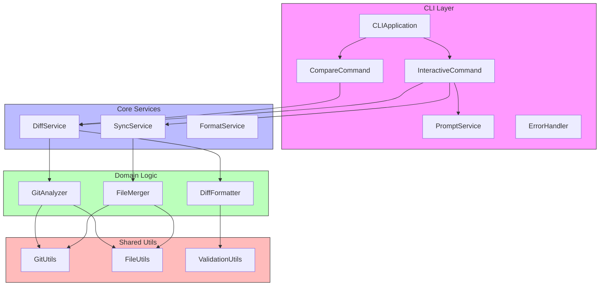

# diff-tree (이름은 변경될 수 있음)

A CLI tool for analyzing and visualizing differences between branches, tags, and commits.
Especially useful for managing code synchronization in projects with delayed deployments.

## Key Features

- 🔍 **Diff Analysis**: Analyze differences between branches, tags, and commits
- 📊 **Multiple Visualizations**: View results in various formats including Tree, Plain, and JSON
- 🌳 **Folder Structure Visualization**: Display changes hierarchically according to folder structure
- 💡 **Interactive Interface**: Step-by-step analysis through an intuitive CLI
- 🎯 **Pattern-based Filtering**: Selective analysis of specific files or directories

## Installation

### Local Install

1. Clone this repository

```bash
git clone
cd diff-tree
```

2. Install dependencies

```bash
pnpm install --frozen-lockfile
```

3. Build

```bash
pnpm run build
```

4. Link

```bash
pnpm link --global
```

### Coming Soon...

(NPM publication planned)

```bash
npm install -g diff-tree
# or
yarn global add diff-tree
# or
pnpm add -g diff-tree
```

## Usage

### Basic Commands

```bash
# Run in interactive mode
git-diff-tree compare -i

# Specify references directly
git-diff-tree compare -f  -t

# Filter files by pattern
git-diff-tree compare -f main -t develop -p "src/**/*.ts"
```

### Output Format Options

```bash
# Tree view (default)
git-diff-tree compare -f main -t develop --format tree

# Plain text
git-diff-tree compare -f main -t develop --format plain

# JSON format
git-diff-tree compare -f main -t develop --format json
```

### Command Options

| Option                    | Description                            |
| ------------------------- | -------------------------------------- |
| `-i, --interactive`       | Run in interactive mode                |
| `-f, --from <ref>`        | Starting reference (branch/tag/commit) |
| `-t, --to <ref>`          | Ending reference (branch/tag/commit)   |
| `-p, --pattern <pattern>` | File filtering pattern                 |
| `--format <type>`         | Output format (tree/plain/json)        |
| `--no-colors`             | Disable colored output                 |
| `--no-icons`              | Disable icons in display               |

## Usage Examples

### Code Synchronization Analysis in Monorepo

1. Analyzing differences between main project and delayed deployment project:

```bash
git-diff-tree compare -f main-proj:v1.0.0 -t delayed-proj:v1.0.0
```

2. Check changes in specific directory:

```bash
git-diff-tree compare -i
# Specify directory pattern in interactive mode: "apps/specific-app/**"
```

## Architecture



### Layer Description

- **CLI Layer**: Handles command-line interface, user interaction, and command routing
- **Core Services**: Orchestrates domain logic and provides high-level interfaces
- **Domain Layer**: Contains core business logic for diff analysis, formatting, and file operations
- **Utilities**: Provides shared functionality for git operations, file handling, and validation

## Example Output

```
╔══════════════════════════════╤═════════════╤═════════╗
║ Path                         │ Type        │ Changes ║
╟──────────────────────────────┼─────────────┼─────────╢
║ 📁                           │             │ 0       ║
╟──────────────────────────────┼─────────────┼─────────╢
║   📄 package.json            │ ❌ deleted  │ -1      ║
╟──────────────────────────────┼─────────────┼─────────╢
║   📄 pnpm-lock.yaml          │ 📝 modified │ +16/-24 ║
╟──────────────────────────────┼─────────────┼─────────╢
║   📁 src                     │             │ +42/-21 ║
╟──────────────────────────────┼─────────────┼─────────╢
║     📁 cli                   │             │ +14/-6  ║
╟──────────────────────────────┼─────────────┼─────────╢
║       📁 core                │             │ +14/-6  ║
╟──────────────────────────────┼─────────────┼─────────╢
║         📄 app.ts            │ 📝 modified │ +7/-2   ║
╟──────────────────────────────┼─────────────┼─────────╢
║         📄 prompt.service.ts │ 📝 modified │ +7/-4   ║
╟──────────────────────────────┼─────────────┼─────────╢
║     📁 domain                │             │ +25/-6  ║
╟──────────────────────────────┼─────────────┼─────────╢
║       📁 analyzer            │             │ +7/-1   ║
╟──────────────────────────────┼─────────────┼─────────╢
║         📄 git-analyzer.ts   │ 📝 modified │ +2/-1   ║
╟──────────────────────────────┼─────────────┼─────────╢
║         📄 types.ts          │ ✨ added    │ +5      ║
╟──────────────────────────────┼─────────────┼─────────╢
║       📁 formatter           │             │ +18/-5  ║
╟──────────────────────────────┼─────────────┼─────────╢
║         📄 diff-formatter.ts │ 📝 modified │ +16/-3  ║
╟──────────────────────────────┼─────────────┼─────────╢
║         📄 types.ts          │ 📝 modified │ +2/-1   ║
╟──────────────────────────────┼─────────────┼─────────╢
║         📄 utils.ts          │ ❌ deleted  │ -1      ║
╟──────────────────────────────┼─────────────┼─────────╢
║     📁 services              │             │ +3/-9   ║
╟──────────────────────────────┼─────────────┼─────────╢
║       📄 diff.service.ts     │ 📝 modified │ +3/-9   ║
╚══════════════════════════════╧═════════════╧═════════╝

Overall Statistics:
Files Changed: 3
Insertions: 75
Deletions: 46

By File Type:
.tsx: 3 files (+75/-46)

```


## Important Notes

- Requires Git repository access
- Reference syntax: `<branch/tag>[:<path>]`
- File patterns support glob and regex
- Interactive mode provides step-by-step guidance
- Sync mode allows controlled file synchronization
- Debug mode available for troubleshooting
